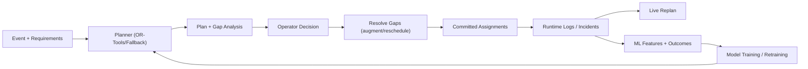
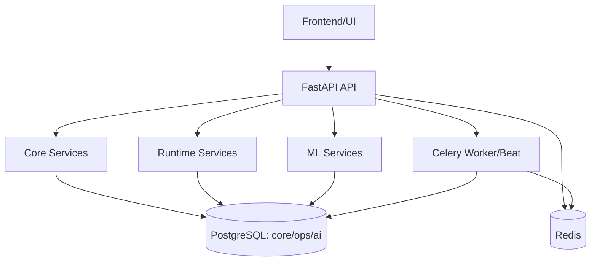

# EventFlow AI

    

EventFlow AI to system backendowy do planowania i live replanningu eventow. Laczy deterministiczny planner zasobów (ludzie/sprzet/pojazdy/czas), runtime operations i warstwe ML do oceny wariantów planu.

## Co ten program robi
- Buduje plan operacyjny eventu (`generate-plan`).
- Wykrywa luki i prowadzi operatora przez decyzje (`preview-gaps` -> `resolve-gaps`).
- Obsluguje incidenty i live replanning bez gubienia zasobów juz zuzytych.
- Prowadzi audit trail wykonania (`ops.*`).
- Trenuje i wykorzystuje modele ML do predykcji i rankingu planów.

## Jak dziala (wysoki poziom)


## Architektura komponentów


## Kluczowe endpointy
### Planner
- `POST /api/planner/generate-plan`
- `POST /api/planner/replan/{event_id}`
- `POST /api/planner/recommend-best-plan`
- `POST /api/planner/preview-gaps/{event_id}`
- `POST /api/planner/resolve-gaps/{event_id}`

### Runtime
- `POST /api/runtime/events/{event_id}/start`
- `POST /api/runtime/events/{event_id}/checkpoint`
- `POST /api/runtime/events/{event_id}/incident`
- `POST /api/runtime/events/{event_id}/complete`

### ML
- `POST /api/ml/features/events/{event_id}`
- `POST /api/ml/models/train-baseline`
- `POST /api/ml/models/harden-duration`
- `POST /api/ml/models/train-plan-evaluator`
- `POST /api/ml/predictions`

## Konfiguracja ENV
- `.env` - aktywny plik konfiguracyjny używany przez aplikację i docker-compose.
- `.env.example` - szablon dla środowiska development.
- `.env.production.example` - szablon dla środowiska production/VPS.

## Quick start
1. Skopiuj konfiguracje (DEV):
```bash
cp .env.example .env
```

2. Uruchom projekt:
```bash
docker compose up --build
```

3. Sprawdz API:
- `http://localhost:8000/health`
- `http://localhost:8000/ready`
- `http://localhost:8000/docs` (tylko gdy `APP_ENV=development` oraz `API_DOCS_ENABLED=true`)

## Frontend (CP-01)
Frontend znajduje sie w katalogu `frontend/` (React + TypeScript + MUI).

1. Uruchom backend i uslugi:
```bash
docker compose up --build
```

2. W nowym terminalu uruchom frontend:
```bash
cd frontend
npm install
npm run dev
```

3. Otworz panel:
- `http://localhost:5173`

4. Logowanie:
- domyslnie (test/development): `test-admin` / `StrongPass!234`
- lub konto utworzone przez endpointy admina.

## Produkcja (VPS)
1. Przygotuj env dla produkcji:
```bash
cp .env.production.example .env
```
2. Ustaw silne sekrety (`JWT_SECRET_KEY`, `POSTGRES_PASSWORD`, bootstrap admin).
3. Skonfiguruj zaufane proxy IP w `AUTH_TRUSTED_PROXY_IPS` (bez `*`).
4. Uruchom preflight:
```bash
python scripts/check_production_env.py
```
5. Wystaw publicznie tylko API (bez publikowania portow Postgres/Redis).

## Testy
Pełna regresja w kontenerze backend:
```bash
docker compose exec -e READY_CHECK_EXTERNALS=false backend pytest -q
```

Scenariusze E2E (w tym scenariusze opisane w `docs/reports/Test_programu.md`):
```bash
docker compose run --rm -e READY_CHECK_EXTERNALS=false -e CELERY_ALWAYS_EAGER=true backend pytest -q tests/test_phase7_cp08.py tests/test_phase8_frontend_cp01.py
```

Frontend quality checks:
```bash
cd frontend
npm run typecheck
npm run test
npm run build
```

## Struktura projektu
- `app/api/` - endpointy
- `app/services/` - logika biznesowa
- `app/models/` - modele SQLAlchemy
- `app/schemas/` - kontrakty API
- `app/workers/` - zadania Celery
- `docker/postgres/init/` - schema + seed dla nowych srodowisk
- `scripts/sql/` - patche SQL dla istniejących instancji
- `tests/` - testy fazowe i regresyjne
- `docs/` - dokumentacja techniczna i operacyjna

## Dokumentacja dla osób trzecich
- Start od: `docs/README.md`
- Architektura/plan: `docs/reference/Plan.md`
- Baza danych: `docs/database/README.md`
- Scenariusze testowe: `docs/reports/Test_programu.md`
- Dziennik implementacji: `raport.txt`
