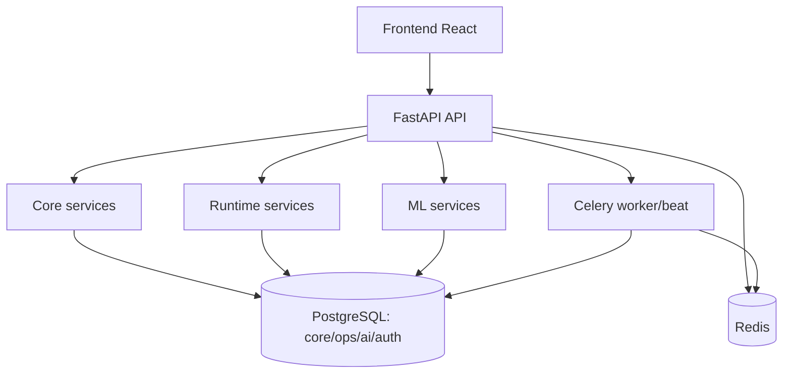

# EventFlow AI

    

EventFlow AI to aplikacja webowa do planowania zasobów, obsługi incydentów live i zbierania danych po eventach. Backend dostarcza API planowania, runtime i ML, a frontend jest panelem operacyjnym dla administratora i zespołu eventowego.

## Co robi system
- Wprowadza event z opisu tekstowego i zamienia go na arkusz danych do zatwierdzenia.
- Generuje i rekomenduje plany zasobów dla przyszłych eventów.
- Obsługuje incydenty live i replanowanie.
- Zapisuje logi po evencie i domyka dane do feedback loop ML.
- Udostępnia podgląd danych biznesowych: eventy, lokalizacje, ludzie, sprzęt, pojazdy i umiejętności.
- Obsługuje użytkowników, role i sesje.

## Architektura


## Quick start
1. Uruchom backend i usługi:
```powershell
docker compose up --build -d
```

2. Sprawdź API:
- `http://localhost:8000/health`
- `http://localhost:8000/ready`
- `http://localhost:8000/docs` tylko w development, gdy `API_DOCS_ENABLED=true`

3. Uruchom frontend:
```powershell
cd frontend
npm install
npm run dev
```

4. Otwórz panel:
- `http://localhost:5173`

5. Logowanie development:
- login: `admin`
- hasło: `Adm1nVPS_2026!Secure`

## One-command local frontend test
Z katalogu projektu:
```powershell
powershell -ExecutionPolicy Bypass -File .\scripts\start-local-test-env.ps1
```

Skrypt uruchamia Docker Compose, czeka na `/ready`, aplikuje idempotentne patche `scripts/sql/cp04_production_readiness.sql`, `scripts/sql/cp05_operational_training_seed.sql`, `scripts/sql/cp06_operational_company_seed.sql` oraz `scripts/sql/cp07_operational_cleanup_and_live_events.sql`, a potem odpala Vite na `http://127.0.0.1:5173`.

CP-06 i CP-07 nie resetują wolumenu PostgreSQL. Patche porządkują istniejące dane operacyjne i utrzymują stan bazy: dodają zasoby firmy, uzupełniają pola eventów, usuwają puste smoke rekordy z checkpointów, dodają eventy `in_progress` dla live dashboardu i zostawiają przyszłe eventy `planned`. Jeżeli chcesz zachować lokalną bazę, nie używaj `docker compose down -v`.

Opcje:
```powershell
powershell -ExecutionPolicy Bypass -File .\scripts\start-local-test-env.ps1 -SkipBuild
powershell -ExecutionPolicy Bypass -File .\scripts\start-local-test-env.ps1 -SkipNpmInstall
```

## LLM w środowisku lokalnym
Domyślnie `.env` ma `AI_AZURE_LLM_ENABLED=false`, więc parser używa heurystyk albo trybu awaryjnego. Żeby frontend korzystał z LLM w flow `Nowy event`, `Replanowanie live` i `Post-event log`, ustaw w `.env`:

```env
AI_AZURE_LLM_ENABLED=true
AZURE_OPENAI_ENDPOINT=https://<twoj-zasob>.openai.azure.com/
AZURE_OPENAI_API_KEY=<klucz>
OPENAI_API_VERSION=2024-08-01-preview
AZURE_DEPLOYMENT_LLM=gpt-4.1-mini
```

Po zmianie `.env` przebuduj backend:
```powershell
docker compose up --build -d
```

Frontend pokazuje przy arkuszach status źródła po angielsku: `Source: LLM`, `Source: deterministic parser` albo `Source: fallback mode`.

Status konfiguracji LLM jest też widoczny w `Moje konto -> Model ML` i dostępny przez:
```powershell
GET /api/ai-agents/llm-status
```

Jeżeli `AI_AZURE_LLM_ENABLED=false` albo brakuje endpointu, klucza lub deploymentu Azure, formularze nadal działają, ale backend użyje trybu awaryjnego.

## Kluczowe endpointy
### Auth
- `POST /auth/login`
- `POST /auth/refresh`
- `GET /auth/me`
- `POST /auth/logout`
- `POST /auth/logout-all`

### Admin
- `GET /admin/users`
- `POST /admin/users`
- `PATCH /admin/users/{user_id}`
- `POST /admin/users/{user_id}/reset-password`

### Intake, planner i runtime
- `POST /api/ai-agents/ingest-event/preview`
- `POST /api/ai-agents/ingest-event/commit`
- `POST /api/planner/generate-plan`
- `POST /api/planner/recommend-best-plan`
- `POST /api/planner/replan/{event_id}`
- `POST /api/runtime/events/{event_id}/incident/parse`
- `POST /api/runtime/events/{event_id}/post-event/parse`
- `POST /api/runtime/events/{event_id}/post-event/commit`

### ML
- `GET /api/ml/models`
- `POST /api/ml/models/retrain-duration`
- `POST /api/ml/models/train-baseline`
- `POST /api/ml/models/harden-duration`
- `POST /api/ml/models/train-plan-evaluator`

## Testy
Backend:
```powershell
docker compose run --rm -e READY_CHECK_EXTERNALS=false -e CELERY_ALWAYS_EAGER=true backend pytest -q
```

Scenariusze E2E/regresyjne Fazy 8:
```powershell
docker compose run --rm -e READY_CHECK_EXTERNALS=false -e CELERY_ALWAYS_EAGER=true backend pytest -q tests/test_phase7_cp08.py tests/test_phase8_frontend_cp01.py tests/test_phase8_frontend_cp03.py tests/test_phase8_frontend_cp04.py tests/test_phase8_frontend_cp05.py tests/test_phase8_frontend_cp06.py tests/test_phase8_frontend_cp07.py
```

Frontend:
```powershell
cd frontend
npm run typecheck
npm run lint
npm run test
npm run build
```

## Struktura projektu
- `app/api/` - endpointy FastAPI
- `app/services/` - logika biznesowa
- `app/models/` - modele SQLAlchemy
- `app/schemas/` - kontrakty API
- `frontend/` - React + TypeScript + MUI
- `docker/postgres/init/` - schema i seed dla nowych środowisk
- `scripts/sql/` - patche SQL dla istniejących instancji
- `tests/` - testy fazowe i regresyjne
- `docs/` - dokumentacja techniczna i operacyjna
- `raport.txt` - dziennik checkpointów
- `non_production/` - archiwum rzeczy zostających na GitHubie, ale niewchodzących do produkcyjnego frontendu

## Przygotowanie pod VPS
1. Uzupełnij `.env` na podstawie `.env.production.example`.
2. Upewnij się, że `APP_ENV=production`, `API_DOCS_ENABLED=false`, `API_TEST_JOBS_ENABLED=false`, `DEMO_ADMIN_ENABLED=false` i `JWT_SECRET_KEY` ma co najmniej 32 znaki.
3. Jeżeli chcesz LLM live, ustaw `AI_AZURE_LLM_ENABLED=true` oraz komplet `AZURE_OPENAI_ENDPOINT`, `AZURE_OPENAI_API_KEY`, `AZURE_DEPLOYMENT_LLM`.
4. Uruchom:
```powershell
docker compose -f docker-compose.vps.yml up --build -d
```
5. Po aktualizacji istniejącej bazy zastosuj patche:
```powershell
docker cp .\scripts\sql\cp04_production_readiness.sql projekt-postgres-1:/tmp/cp04_production_readiness.sql
docker compose -f docker-compose.vps.yml exec -T postgres psql -U eventflow -d eventflow -v ON_ERROR_STOP=1 -f /tmp/cp04_production_readiness.sql
docker cp .\scripts\sql\cp05_operational_training_seed.sql projekt-postgres-1:/tmp/cp05_operational_training_seed.sql
docker compose -f docker-compose.vps.yml exec -T postgres psql -U eventflow -d eventflow -v ON_ERROR_STOP=1 -f /tmp/cp05_operational_training_seed.sql
docker cp .\scripts\sql\cp06_operational_company_seed.sql projekt-postgres-1:/tmp/cp06_operational_company_seed.sql
docker compose -f docker-compose.vps.yml exec -T postgres psql -U eventflow -d eventflow -v ON_ERROR_STOP=1 -f /tmp/cp06_operational_company_seed.sql
docker cp .\scripts\sql\cp07_operational_cleanup_and_live_events.sql projekt-postgres-1:/tmp/cp07_operational_cleanup_and_live_events.sql
docker compose -f docker-compose.vps.yml exec -T postgres psql -U eventflow -d eventflow -v ON_ERROR_STOP=1 -f /tmp/cp07_operational_cleanup_and_live_events.sql
```

Używaj wariantu `docker cp` + `psql -f`, żeby PowerShell nie przekodował polskich znaków w SQL. Produkcja nie powinna kopiować `non_production/`, lokalnych cache, POC ani starego buildu frontendu. Te ścieżki są wykluczone w `.dockerignore`, a frontend ma osobny `frontend/.dockerignore`.
